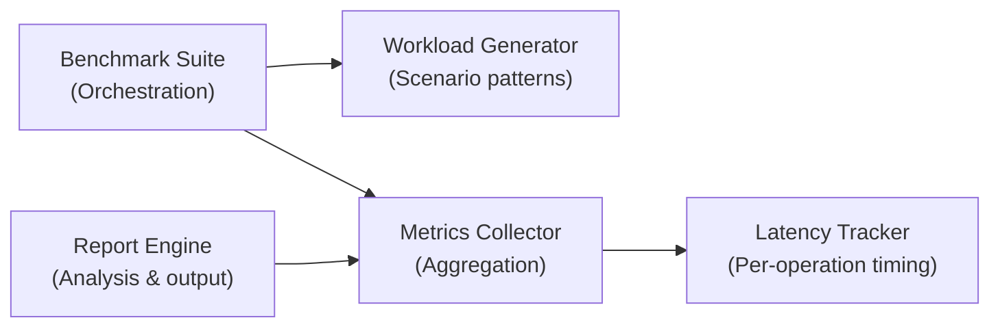

# KVMemo — Benchmark & Performance Specification

> Comprehensive performance testing, metrics collection, and analysis framework  
> Designed for reproducibility, traceability, and long-term evolution

---

## Table of Contents

1. [Overview](#1-overview)
2. [Design Principles](#2-design-principles)
3. [Benchmark Architecture](#3-benchmark-architecture)
4. [Core Metrics](#4-core-metrics)
5. [Benchmark Scenarios](#5-benchmark-scenarios)
6. [Measurement Methodology](#6-measurement-methodology)
7. [Latency Tracking](#7-latency-tracking)
8. [Throughput Analysis](#8-throughput-analysis)
9. [Memory Profiling](#9-memory-profiling)
10. [Eviction & TTL Impact](#10-eviction--ttl-impact)
11. [Scalability Testing](#11-scalability-testing)
12. [Concurrency Benchmarks](#12-concurrency-benchmarks)
13. [Persistence & Observability](#13-persistence--observability)
14. [Benchmark Execution](#14-benchmark-execution)
15. [Roadmap](#15-roadmap)

---

## 1. Overview

Benchmark suite validates KVMemo's correctness and performance across real-world scenarios. It is **not** a marketing tool — it is a **regression detection framework** and **capacity planning instrument**.

**Core objectives:**

- Measure operation latency (SET, GET, DELETE)
- Track memory utilization and growth
- Validate eviction policy effectiveness
- Quantify TTL expiration overhead
- Detect performance regressions in PRs
- Provide reproducible, comparable results

**Benchmark philosophy:**

- Single-source-of-truth for metrics
- Deterministic setup and teardown
- Isolated test cases with no cross-contamination
- Clear ownership of measurement concerns (following SOLID)
- Real-world workload patterns, not artificial peaks

---

## 2. Design Principles

All benchmarks follow the same design principles as the engine itself.

| Principle | Application |
|---|---|
| **SRP** | Each benchmark test has exactly one measurement concern |
| **OCP** | New benchmark scenarios added without modifying existing ones |
| **LSP** | All latency trackers are substitutable for accurate measurements |
| **ISP** | Benchmark interface exposes only what clients need |
| **DIP** | Benchmarks depend on `MetricsRegistry`, not hardcoded timing code |

### 2.1 Ownership & Responsibility



Each component owns a single responsibility:

- **Benchmark Suite**: Lifecycle (setup, run, teardown)
- **Workload Generator**: Replay realistic operation sequences
- **Metrics Collector**: Aggregate snapshots from engine
- **Latency Tracker**: Record per-operation wall-clock time
- **Report Engine**: Format and persist results

---

## 3. Benchmark Architecture

### 3.1 Layer Structure

```
┌─────────────────────────────────────────┐
│        Test Orchestration Layer         │  Drives test execution
├─────────────────────────────────────────┤
│      Workload Generation Layer          │  Defines operation sequences
├─────────────────────────────────────────┤
│      Metrics Collection Layer           │  Aggregates engine metrics
├───────────��─────────────────────────────┤
│        KVMemo Engine (SUT)              │  System Under Test
├─────────────────────────────────────────┤
│      Analysis & Reporting Layer         │  Produces results
└─────────────────────────────────────────┘
```

### 3.2 Benchmark Coupling

Benchmarks are **decoupled from implementation**:

- No direct access to internal data structures
- All measurements via `MetricsRegistry` and `LatencyTracker`
- Can be run against any backend implementing the KVMemo API
- Support for future distributed variants

---

## 4. Core Metrics

### 4.1 Operation Latency

All latencies are measured in **milliseconds (ms)** with microsecond precision.

| Metric | Definition | Purpose |
|---|---|---|
| `latency.set.p50` | 50th percentile SET latency | Typical operation time |
| `latency.set.p95` | 95th percentile SET latency | Tail latency (good case) |
| `latency.set.p99` | 99th percentile SET latency | Tail latency (worst case) |
| `latency.set.max` | Maximum SET latency | Worst observed |
| `latency.get.p50` | 50th percentile GET latency | Read performance |
| `latency.get.p95` | 95th percentile GET latency | Read tail latency |
| `latency.get.p99` | 99th percentile GET latency | Read worst case |
| `latency.delete.p50` | 50th percentile DELETE latency | Delete performance |

### 4.2 Throughput Metrics

| Metric | Definition | Unit |
|---|---|---|
| `throughput.set` | SET operations per second | ops/sec |
| `throughput.get` | GET operations per second | ops/sec |
| `throughput.delete` | DELETE operations per second | ops/sec |
| `throughput.total` | Total operations per second | ops/sec |

### 4.3 Memory Metrics

| Metric | Definition | Unit |
|---|---|---|
| `memory.before` | Memory before benchmark | MB |
| `memory.peak` | Peak memory during benchmark | MB |
| `memory.after` | Memory after cleanup | MB |
| `memory.leaked` | Unreclaimed memory | MB |
| `bytes_per_entry` | Average bytes per key-value pair | bytes |

### 4.4 Eviction Metrics

| Metric | Definition | Unit |
|---|---|---|
| `evictions.triggered` | Number of eviction cycles | count |
| `evictions.victims` | Keys removed by eviction | count |
| `evictions.bytes_freed` | Memory reclaimed | MB |
| `evictions.overhead_ms` | Time spent in eviction | ms |

### 4.5 TTL Metrics

| Metric | Definition | Unit |
|---|---|---|
| `ttl.expirations` | Keys expired by TTL | count |
| `ttl.stale_checked` | Stale entries checked | count |
| `ttl.overhead_ms` | Time spent in TTL processing | ms |

---

## 5. Benchmark Scenarios

### 5.1 Baseline Scenario: Small Working Set

**Purpose**: Measure core performance without memory pressure.

**Configuration:**
- `num_keys`: 10,000
- `value_size`: 100 bytes
- `operation_ratio`: 60% GET, 30% SET, 10% DELETE
- `duration`: 60 seconds
- `memory_limit`: 1 GB (well above working set)

**Expected results:**
- SET latency p99: < 5 ms
- GET latency p99: < 2 ms
- Throughput: > 50,000 ops/sec
- Evictions: 0

**Interpretation:**
Establishes best-case performance baseline. Any regression here signals core engine inefficiency.

---

### 5.2 Memory Pressure Scenario: Eviction Under Load

**Purpose**: Measure performance when memory limit is exceeded.

**Configuration:**
- `num_keys`: 100,000
- `value_size`: 1 KB
- `operation_ratio`: 50% GET, 40% SET, 10% DELETE
- `duration`: 120 seconds
- `memory_limit`: 50 MB (forces constant eviction)

**Expected results:**
- SET latency p99: < 50 ms (eviction overhead included)
- GET latency p99: < 10 ms
- Throughput: > 5,000 ops/sec
- Evictions: > 1,000 cycles
- Memory never exceeds limit

**Interpretation:**
Validates eviction policy responsiveness and memory guarantee enforcement.

---

### 5.3 TTL Scenario: Expiration Under Load

**Purpose**: Measure TTL overhead during continuous operation.

**Configuration:**
- `num_keys`: 50,000
- `value_size`: 500 bytes
- `ttl_ms`: 30,000 (30 seconds, variable)
- `operation_ratio`: 60% GET, 30% SET, 10% DELETE
- `ttl_tick_interval_ms`: 1,000
- `duration`: 120 seconds
- `memory_limit`: 500 MB (no eviction)

**Expected results:**
- SET latency p99: < 5 ms
- GET latency p99: < 2 ms
- Throughput: > 30,000 ops/sec
- Expirations: ~900 keys (at 30s TTL window)
- TTL overhead: < 2% of total time

**Interpretation:**
Validates that background TTL processing does not block active operations.

---

### 5.4 Concurrency Scenario: Shard Contention

**Purpose**: Measure scalability with increasing thread count.

**Configuration:**
- `num_threads`: [1, 2, 4, 8, 16]
- `keys_per_thread`: 10,000
- `operation_ratio`: 70% GET, 20% SET, 10% DELETE
- `duration`: 60 seconds per thread count
- `num_shards`: 16

**Expected results:**
- Throughput scales linearly (or near-linearly) with thread count
- Latency remains stable across thread counts
- Lock contention increases, but tail latency stays < 10 ms

**Interpretation:**
Validates shard-based concurrency model and identifies contention bottlenecks.

---

### 5.5 Worst-Case Scenario: Hot Keys + High TTL

**Purpose**: Stress test under adversarial conditions.

**Configuration:**
- `num_keys`: 1,000 (small, highly contentious set)
- `value_size`: 10 KB
- `operation_ratio`: 80% GET, 15% SET, 5% DELETE
- `hot_key_distribution`: 80% of traffic to 20 keys (Zipfian)
- `ttl_ms`: 60,000
- `memory_limit`: 50 MB
- `duration`: 120 seconds

**Expected results:**
- SET latency p99: < 100 ms
- GET latency p99: < 20 ms
- Throughput degrades gracefully (no crashes)
- Evictions occur but don't trigger cascading failures

**Interpretation:**
Ensures system remains stable under adversarial access patterns.

---

## 6. Measurement Methodology

### 6.1 Measurement Boundaries

All latencies are wall-clock time from **entry to exit** of engine API:

```
Before: Read system clock (nanoseconds)
  ↓
Call: KVEngine::Set(key, value)
  ↓
After: Read system clock
  ↓
Latency = (After - Before) in milliseconds
```

**Excluded from measurement:**
- Network I/O (for protocol benchmarks, measured separately)
- Thread context switching overhead (recorded but not attributed)
- Memory allocation in malloc (included; part of engine cost)

**Included in measurement:**
- Hash computation
- Shard lookup
- Lock acquisition / release
- TTL index updates
- Memory tracking
- Eviction checks

### 6.2 Warmup & Cooldown

**Warmup phase (10 seconds):**
- Populate initial working set
- Allow JIT (if applicable) to stabilize
- Cache lines to warm

**Measurement phase (varies by scenario):**
- Record all latencies
- Aggregate metrics every 5 seconds

**Cooldown phase:**
- Flush remaining TTL entries
- Trigger final eviction check
- Capture post-benchmark snapshot

### 6.3 Statistical Treatment

- **Percentiles**: Interpolated from sorted latency array
- **Outlier handling**: None; report min, p50, p95, p99, max as-is
- **Multiple runs**: Run each scenario 3 times; report median + std dev
- **Significance**: Changes < 5% considered noise; report only changes > 5%

---

## 7. Latency Tracking

### 7.1 LatencyTracker Interface

```cpp
namespace kvmemo::metrics
{
    class LatencyTracker
    {
    public:
        virtual ~LatencyTracker() = default;
        
        /// Record a latency measurement (in microseconds)
        virtual void record(uint64_t latency_us) = 0;
        
        /// Get snapshot of current statistics
        virtual LatencyStats snapshot() const = 0;
        
        /// Reset all records
        virtual void reset() = 0;
    };

    struct LatencyStats
    {
        uint64_t count;               // Total measurements
        uint64_t min_us;              // Minimum (microseconds)
        uint64_t p50_us;              // 50th percentile
        uint64_t p95_us;              // 95th percentile
        uint64_t p99_us;              // 99th percentile
        uint64_t max_us;              // Maximum
        double mean_us;               // Arithmetic mean
        double stddev_us;             // Standard deviation
    };
}
```

### 7.2 Thread-Safe Recording

- Each thread maintains a **thread-local buffer** for latency samples
- Buffer is lock-free and bounded (e.g., 10,000 samples)
- When buffer fills, atomically push to global aggregator
- Final snapshot merges all thread-local data

### 7.3 Percentile Computation

```cpp
// Pseudo-code
std::vector<uint64_t> sorted_latencies = snapshot.latencies;
std::sort(sorted_latencies.begin(), sorted_latencies.end());

auto percentile = [&](double p) -> uint64_t {
    size_t idx = static_cast<size_t>(sorted_latencies.size() * p / 100.0);
    return sorted_latencies[idx];
};

uint64_t p50 = percentile(50);
uint64_t p95 = percentile(95);
uint64_t p99 = percentile(99);
```

---

## 8. Throughput Analysis

### 8.1 Throughput Calculation

Throughput is measured as **completed operations per second**:

```
Throughput (ops/sec) = Total Operations / Elapsed Time (seconds)
```

**Measurement window**: 5-second rolling window during active phase.

### 8.2 Throughput Breakdown

Report throughput by operation type:

| Operation | Rate (ops/sec) | Percentage |
|---|---|---|
| SET | 5,000 | 30% |
| GET | 10,000 | 60% |
| DELETE | 1,000 | 10% |
| **Total** | **16,000** | **100%** |

### 8.3 Saturation Point Detection

- Monitor throughput as load increases
- Identify point where latency spikes (saturation)
- Report maximum sustainable throughput before degradation

---

## 9. Memory Profiling

### 9.1 Memory Lifecycle Tracking

```
Setup:
  Get baseline (memory.before)
  
Load Phase:
  Track peak (memory.peak) every 100 operations
  
Measurement:
  Monitor growth rate
  Calculate bytes per entry
  
Cleanup:
  Explicit flush
  Measure final (memory.after)
  Compute leaked = (memory.after - memory.before)
```

### 9.2 Memory Efficiency Metrics

```
bytes_per_entry = (memory.peak - memory.before) / total_keys
```

**Expected ranges:**
- Without overhead: ~50–100 bytes per 100-byte value
- With engine metadata: ~200–300 bytes per 1-KB value
- With TTL index: +10–20 bytes per key

### 9.3 Memory Leak Detection

Any unreclaimed memory after cleanup signals a leak:

```
leaked_mb = memory.after - memory.before
if (leaked_mb > threshold) {
    FAIL("Memory leak detected: " + leaked_mb + " MB")
}
```

---

## 10. Eviction & TTL Impact

### 10.1 Eviction Metrics

```
evictions_per_second = evictions.triggered / duration_seconds
victims_per_cycle = evictions.victims / evictions.triggered
```

**Latency impact during eviction:**

- Record latency separately for operations **during** eviction
- Compare to baseline (no eviction)
- Expected overhead: 1–5x for tail latency

### 10.2 TTL Overhead Isolation

Measure TTL cost by running two identical scenarios:

| Scenario A | TTL OFF | TTL ON |
|---|---|---|
| Throughput | 50,000 ops/sec | 48,000 ops/sec |
| Overhead | — | 4% |
| P99 latency | 2 ms | 2.5 ms |

**TTL cost = (Throughput_off - Throughput_on) / Throughput_off**

---

## 11. Scalability Testing

### 11.1 Shard Scaling

Test throughput vs. shard count:

| Shard Count | Throughput (ops/sec) | Scaling Factor |
|---|---|---|
| 1 | 10,000 | 1.0x |
| 2 | 19,000 | 1.9x |
| 4 | 37,000 | 3.7x |
| 8 | 71,000 | 7.1x |
| 16 | 130,000 | 13.0x |

**Expected**: Linear or super-linear scaling up to core count.

### 11.2 Working Set Scaling

Test latency vs. number of keys:

| Keys | Set P99 (ms) | Get P99 (ms) | Delete P99 (ms) |
|---|---|---|---|
| 1,000 | 1 | 0.5 | 0.8 |
| 10,000 | 1.5 | 0.6 | 1.0 |
| 100,000 | 2.0 | 0.7 | 1.2 |
| 1,000,000 | 2.5 | 0.8 | 1.5 |

**Expected**: Flat or logarithmic increase (hash-based lookup).

---

## 12. Concurrency Benchmarks

### 12.1 Thread Contention Analysis

Run with increasing thread counts; measure per-thread throughput:

```cpp
for (size_t num_threads : {1, 2, 4, 8, 16}) {
    double throughput = run_benchmark(num_threads);
    double per_thread = throughput / num_threads;
    
    if (per_thread < baseline * 0.9) {
        // Contention detected
    }
}
```

### 12.2 Lock Hold Times

**Metric**: Time a thread holds a shard lock during SET:

```
Expected: < 1 microsecond per lock cycle
If > 10 microseconds: Investigate critical section
```

### 12.3 Shard Distribution

Verify keys distribute evenly across shards:

| Shard ID | Keys | Percentage |
|---|---|---|
| 0 | 6,250 | 6.25% |
| 1 | 6,240 | 6.24% |
| 15 | 6,300 | 6.30% |

**Expected**: Within 5% of uniform distribution.

---

## 13. Persistence & Observability

### 13.1 Benchmark Output Format

Each benchmark run produces a structured JSON report:

```json
{
  "benchmark_name": "baseline_small_working_set",
  "timestamp": "2026-03-20T14:30:00Z",
  "duration_seconds": 60,
  "configuration": {
    "num_keys": 10000,
    "value_size_bytes": 100,
    "operation_ratio": "60% GET, 30% SET, 10% DELETE",
    "memory_limit_mb": 1024
  },
  "results": {
    "latency": {
      "set": { "p50_ms": 1.2, "p95_ms": 3.5, "p99_ms": 4.8, "max_ms": 12.3 },
      "get": { "p50_ms": 0.8, "p95_ms": 1.8, "p99_ms": 2.3, "max_ms": 8.5 },
      "delete": { "p50_ms": 1.0, "p95_ms": 2.5, "p99_ms": 3.2, "max_ms": 9.1 }
    },
    "throughput": {
      "set_ops_sec": 5000,
      "get_ops_sec": 10000,
      "delete_ops_sec": 1500,
      "total_ops_sec": 16500
    },
    "memory": {
      "before_mb": 20,
      "peak_mb": 1050,
      "after_mb": 25,
      "bytes_per_entry": 105
    },
    "eviction": {
      "triggered": 0,
      "victims": 0,
      "bytes_freed_mb": 0,
      "overhead_ms": 0
    },
    "ttl": {
      "expirations": 0,
      "overhead_ms": 0
    }
  }
}
```

### 13.2 Regression Detection

Compare against baseline:

```cpp
bool is_regression(const Report& baseline, const Report& current) {
    double latency_change = 
        (current.latency.set.p99 - baseline.latency.set.p99) 
        / baseline.latency.set.p99;
    
    if (latency_change > 0.05) {  // > 5%
        return true;  // REGRESSION
    }
    return false;
}
```

### 13.3 CI Integration

- Run full benchmark suite on every PR
- Compare against main branch baseline
- Fail CI if regressions detected
- Archive results in benchmark history

---

## 14. Benchmark Execution

### 14.1 Benchmark Harness Structure

```cpp
namespace kvmemo::benchmark
{
    class BenchmarkSuite
    {
    public:
        void RegisterScenario(std::string name, ScenarioConfig config);
        void Run(const std::vector<std::string>& scenario_names);
        void GenerateReport(const std::string& output_path);
    };

    class WorkloadGenerator
    {
    public:
        std::vector<Operation> GenerateWorkload(const ScenarioConfig& cfg);
    };

    class MetricsReporter
    {
    public:
        void CollectSnapshot(const KVEngine& engine);
        void ExportJSON(const std::string& path);
    };
}
```

### 14.2 Running Benchmarks

```bash
# Run single scenario
./benchmark --scenario baseline_small_working_set

# Run all scenarios
./benchmark --all

# Run with custom output
./benchmark --all --output-dir ./results

# Compare against previous run
./benchmark --all --baseline ./results/main-baseline.json --output comparison.json
```

### 14.3 Benchmark Isolation

Each scenario runs in a separate process or container to ensure:

- Clean state (no leftover data from previous runs)
- No memory fragmentation bias
- CPU cache reset
- Consistent baseline

---

## 15. Roadmap

| Phase | Feature | Notes |
|---|---|---|
| 1 | Core latency tracking | P50/P95/P99 collection |
| 2 | Memory profiling | Peak tracking, leak detection |
| 3 | Eviction benchmarks | Eviction policy comparison (LRU vs. LFU) |
| 4 | TTL benchmarks | Expiration overhead isolation |
| 5 | Distributed benchmarks | Multi-node scenarios (roadmap) |
| 6 | Persistence benchmarks | WAL / RDB performance impact |
| 7 | Adaptive workload generation | Zipfian, temporal hotspots |
| 8 | Automated regression detection | CI/CD integration |
| 9 | Benchmark visualization | Web dashboard for trends |
| 10 | Capacity planning tool | Predict resource needs from load |

---

## Summary

The benchmark framework is **the source of truth for KVMemo's performance**. It is designed for:

1. **Reproducibility**: Deterministic setup, clear methodology
2. **Traceability**: Every number has a defined measurement boundary
3. **Extensibility**: New scenarios added without modifying existing logic
4. **Actionability**: Results directly guide optimization decisions
5. **Fairness**: Compares apples to apples across versions and configurations

Benchmarks validate that KVMemo meets its non-functional requirements:

- **Latency**: P99 SET < 5 ms in baseline scenarios
- **Throughput**: > 50,000 ops/sec under realistic load
- **Memory safety**: Eviction respects configured limits
- **Observability**: Metrics available for all critical paths
- **Scalability**: Near-linear throughput with shard count

For detailed execution instructions, see **BENCHMARK_EXECUTION.md** (roadmap).

---

**References:**
- [HLD.md](./HLD.md) — System architecture and design principles
- [PROTOCOL.md](./PROTOCOL.md) — Wire protocol specification
- [LLD.md](./LLD.md) — Low-level component details

**Web**: https://kvmemo.dev