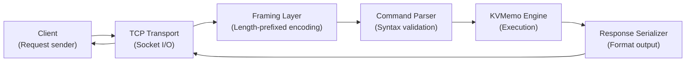
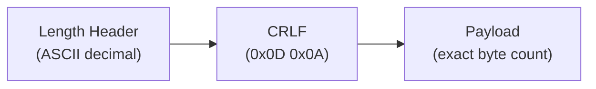
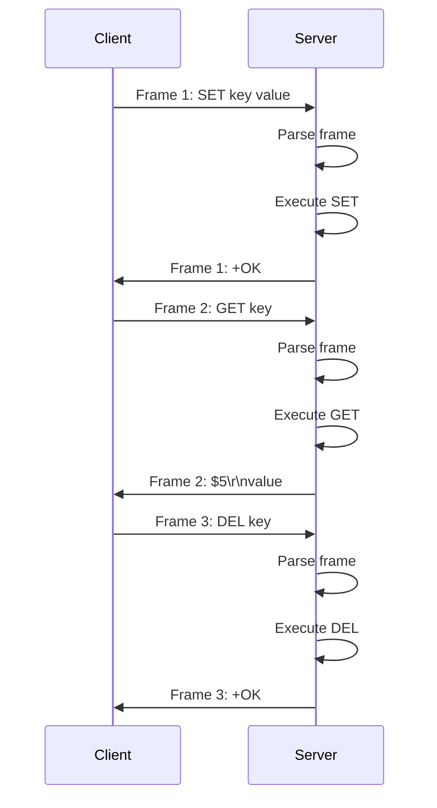
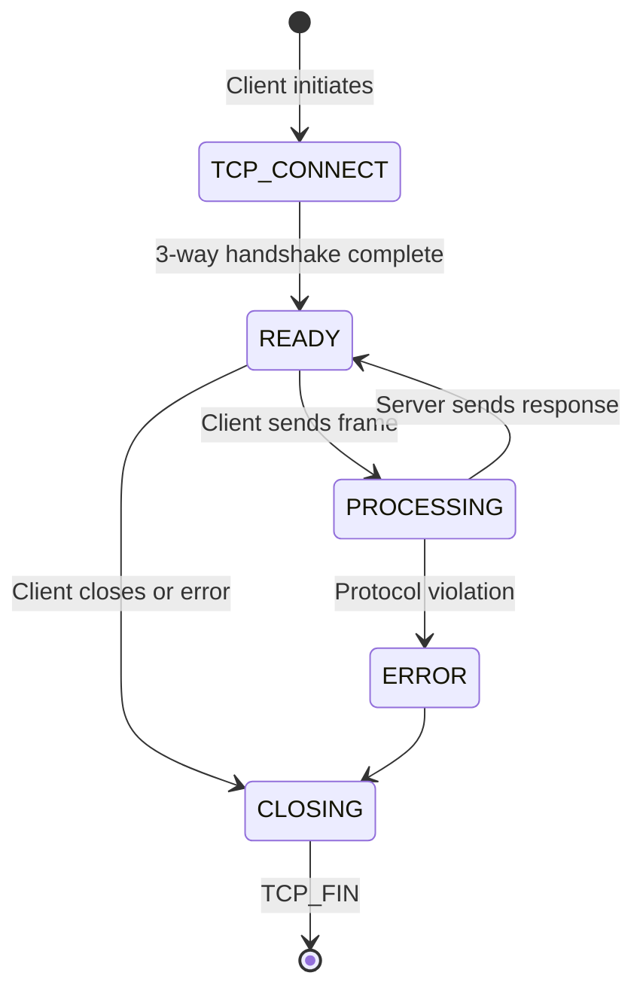

# KVMemo Wire Protocol Specification

> Version: 1.0  
> Transport: TCP  
> Encoding: UTF-8 (text-based protocol)  
> Framing: Length-prefixed  
> Status: Stable (backward compatible evolution)

---

## Table of Contents

1. [Overview](#1-overview)
2. [Design Philosophy](#2-design-philosophy)
3. [Transport Layer](#3-transport-layer)
4. [Message Framing](#4-message-framing)
5. [Command Grammar](#5-command-grammar)
6. [Supported Commands (v1.0)](#6-supported-commands-v10)
7. [Request/Response Semantics](#7-requestresponse-semantics)
8. [Error Handling](#8-error-handling)
9. [Expiration Semantics](#9-expiration-semantics)
10. [Connection Lifecycle](#10-connection-lifecycle)
11. [Partial Read Handling](#11-partial-read-handling)
12. [Security Considerations](#12-security-considerations)
13. [Performance Characteristics](#13-performance-characteristics)
14. [Implementation Guide](#14-implementation-guide)
15. [Protocol Versioning & Roadmap](#15-protocol-versioning--roadmap)

---

## 1. Overview

KVMemo uses a **lightweight, deterministic, length-prefixed request/response protocol** over TCP. The protocol is designed to be simple to implement, efficient to parse, human-readable, and extensible.

**Core characteristics:**

- **Synchronous**: Client sends request, server replies with response
- **Sequential**: One request → one response per connection (no pipelining in v1.0)
- **Length-prefixed**: All messages prefixed with explicit byte count
- **Text-based**: Human-readable, debuggable without special tools
- **Stateless**: Each request is independent; server holds no per-connection state

**Primary use cases:**

- Client-server key-value storage operations (SET, GET, DELETE)
- TTL-aware storage with automatic expiration
- Real-time data access from multiple clients
- Easy integration with existing TCP-based tools and frameworks

**Not suitable for:**

- High-frequency request pipelining (consider v2.0 multiplexing)
- Binary data without encoding (use base64 if needed)
- Request streaming (messages must fit in memory)

---

## 2. Design Philosophy

### 2.1 SOLID Principles in Protocol Design

The wire protocol follows SOLID principles to ensure extensibility and maintainability:

| Principle | Application |
|---|---|
| **SRP** | Each command has one responsibility; framing is separate from parsing |
| **OCP** | Protocol extensible for new commands without modifying framing layer |
| **LSP** | All commands follow identical request/response contract |
| **ISP** | Clients depend only on commands they use; minimal parsing required |
| **DIP** | Protocol depends on abstractions (message, command), not concrete types |

### 2.2 Protocol Ownership



**Clear ownership boundaries:**

- **Client**: Generates well-formed requests
- **Transport**: Manages socket lifecycle
- **Framing**: Encodes/decodes length headers
- **Parser**: Validates command syntax
- **Engine**: Executes command semantics
- **Serializer**: Formats responses

No layer violates its boundary. Clients never parse the engine directly.

### 2.3 Protocol Stability Guarantee

**Backward Compatibility Promise:**

- v1.0 commands will remain functional in v2.0+
- New commands added via version negotiation
- Existing clients work without modification
- Graceful degradation on unsupported features

---

## 3. Transport Layer

### 3.1 TCP Connection

- **Port**: Configurable (default: 6379, reserved for Redis-compatible clients)
- **Address family**: IPv4 and IPv6
- **Connection timeout**: Client-configurable (suggested: 5 seconds)
- **Keep-alive**: Supported via SO_KEEPALIVE (optional)

### 3.2 Connection Semantics

| Aspect | Behavior |
|---|---|
| **Persistent connections** | Yes; reuse for multiple commands |
| **Connection pooling** | Clients encouraged to maintain connection pool |
| **Server-initiated close** | Server closes on malformed frame or protocol error |
| **Client-initiated close** | Graceful; server flushes pending writes |
| **Idle timeout** | No default (application-specific) |

### 3.3 Socket Configuration

**Recommended client settings:**

```cpp
int sock = socket(AF_INET, SOCK_STREAM, 0);

// Disable Nagle's algorithm for low-latency (important for KV ops)
int flag = 1;
setsockopt(sock, IPPROTO_TCP, TCP_NODELAY, &flag, sizeof(flag));

// Set receive timeout
struct timeval timeout;
timeout.tv_sec = 5;
timeout.tv_usec = 0;
setsockopt(sock, SOL_SOCKET, SO_RCVTIMEO, &timeout, sizeof(timeout));

// Set send timeout
setsockopt(sock, SOL_SOCKET, SO_SNDTIMEO, &timeout, sizeof(timeout));
```

---

## 4. Message Framing

### 4.1 Frame Format

All messages follow a strict format:

```
{length}\r\n{payload}
```

Where:
- `{length}` = decimal number of bytes in payload (ASCII digits)
- `\r\n` = CRLF (carriage return + line feed, bytes 0x0D 0x0A)
- `{payload}` = exact number of bytes specified by length

### 4.2 Frame Structure Diagram



### 4.3 Framing Examples

#### Example 1: Simple SET

```
Input:  SET mykey hello
Bytes:  S E T   m y k e y   h e l l o
Count:  23 bytes
Wire:   23\r\nSET mykey hello
        └─ header
            └─ separator
               └─ payload (23 bytes)
```

**Breakdown:**
- Header: `23` (2 bytes)
- CRLF: `\r\n` (2 bytes)
- Payload: `SET mykey hello` (15 bytes)
- **Total wire bytes: 19**

#### Example 2: SET with TTL

```
Input:  SET session:abc data PX 60000
Count:  31 bytes
Wire:   31\r\nSET session:abc data PX 60000
```

#### Example 3: GET with special characters

```
Input:  GET key:with:colons
Count:  21 bytes
Wire:   21\r\nGET key:with:colons
```

### 4.4 Frame Parsing Algorithm

**Pseudo-code for parsing a single frame:**

```cpp
std::string parse_frame(Socket& socket) {
    // Step 1: Read until CRLF to get length
    std::string length_str;
    while (true) {
        char c = socket.read_byte();
        if (c == '\r') {
            char lf = socket.read_byte();
            if (lf != '\n') {
                throw ProtocolError("Expected LF after CR");
            }
            break;
        }
        if (!isdigit(c)) {
            throw ProtocolError("Invalid character in length header");
        }
        length_str += c;
    }
    
    // Step 2: Parse length as decimal integer
    uint32_t payload_length = std::stoul(length_str);
    if (payload_length > MAX_PAYLOAD_SIZE) {  // e.g., 512 MB
        throw ProtocolError("Payload exceeds maximum size");
    }
    
    // Step 3: Read exact number of payload bytes
    char* buffer = new char[payload_length];
    socket.read_exact(buffer, payload_length);
    
    // Step 4: Return payload as string
    std::string payload(buffer, payload_length);
    delete[] buffer;
    return payload;
}
```

### 4.5 Maximum Frame Size

| Limit | Value | Rationale |
|---|---|---|
| Max payload length | 512 MB | Prevents OOM attacks; configurable per deployment |
| Max length header digits | 10 | Fits all 32-bit unsigned integers |
| Typical value size | 1 MB | Common for application data |

---

## 5. Command Grammar

### 5.1 Command Format

All commands follow a uniform grammar:

```
COMMAND [arg1] [arg2] ... [argN]
```

**Rules:**

- Commands are **case-insensitive** (internally converted to uppercase)
- Arguments are **space-separated** (single space)
- **No escaping** for spaces within values (not supported in v1.0)
- **No comments** or extra whitespace
- **Trailing whitespace** is optional

### 5.2 Grammar BNF

```
<command>    ::= <cmd_name> [<arguments>]
<cmd_name>   ::= "SET" | "GET" | "DEL" | "EXISTS" | "INCR" | ...
<arguments>  ::= <arg> [<arg>]*
<arg>        ::= <token> | <number> | <keyword>
<token>      ::= [a-zA-Z0-9_:\-\.]+
<number>     ::= [0-9]+
<keyword>    ::= "PX" | "NX" | "XX" | ...
```

### 5.3 Argument Ordering

Argument order is **strict and not interchangeable**:

**Valid:**
```
SET key value PX 60000    ✓ (value, then TTL)
SET key value NX          ✓ (value, then flag)
```

**Invalid:**
```
SET key PX 60000 value    ✗ (TTL before value)
SET PX 60000 key value    ✗ (flag before key)
```

---

## 6. Supported Commands (v1.0)

### 6.1 SET — Store Key-Value Pair

**Syntax:**
```
SET <key> <value> [PX <ttl_ms>] [NX|XX]
```

**Parameters:**

| Parameter | Type | Required | Description |
|---|---|---|---|
| `key` | string | Yes | Key identifier (1–256 characters) |
| `value` | string | Yes | Value data (1–50 MB) |
| `PX ttl_ms` | optional | No | TTL in milliseconds (0–2^63-1) |
| `NX` | optional | No | Set only if key does NOT exist |
| `XX` | optional | No | Set only if key EXISTS |

**Response:**
- `+OK` — Key set successfully
- `-ERR invalid argument` — Invalid argument count or type
- `-ERR key exists` — NX specified but key exists
- `-ERR key not found` — XX specified but key does not exist
- `-ERR value too large` — Value exceeds maximum size

**Examples:**

```
Request:  SET user:1 Alice
Response: +OK

Request:  SET session:xyz data PX 60000
Response: +OK

Request:  SET user:2 Bob NX
Response: +OK

Request:  SET user:1 Charlie XX
Response: +OK (user:1 already exists)

Request:  SET user:2 Bob NX
Response: -ERR key exists (user:2 was just set)
```

### 6.2 GET — Retrieve Value by Key

**Syntax:**
```
GET <key>
```

**Parameters:**

| Parameter | Type | Required | Description |
|---|---|---|---|
| `key` | string | Yes | Key identifier |

**Response:**
- `$<length>\r\n<value>` — Value found (bulk string format)
- `$-1` — Key not found or expired
- `-ERR invalid argument` — Invalid argument count

**Bulk String Format:**

The `$<length>\r\n<value>` format allows values containing CRLF:

```
Request:  GET multiline_value
Response: $20\r\nHello\r\nWorld\r\nOK
          └─ length includes CRLF in value
          └─ exact 20 bytes follow
```

**Examples:**

```
Request:  GET user:1
Response: $5\r\nAlice
          └─ Alice is 5 bytes

Request:  GET user:99
Response: $-1
          └─ Key not found

Request:  GET session:expired
Response: $-1
          └─ Key expired (transparent to client)
```

### 6.3 DEL — Delete Key

**Syntax:**
```
DEL <key>
```

**Parameters:**

| Parameter | Type | Required | Description |
|---|---|---|---|
| `key` | string | Yes | Key identifier |

**Response:**
- `+OK` — Key deleted (whether or not it existed)
- `-ERR invalid argument` — Invalid argument count

**Examples:**

```
Request:  DEL user:1
Response: +OK

Request:  DEL user:99
Response: +OK
          └─ Returns OK even if key didn't exist
```

### 6.4 KEYS — Retrieve All Key-Value Pairs

**Syntax:**
```
KEYS
```

**Parameters:**

| Parameter | Type | Required | Description |
|---|---|---|---|
| *(none)* | — | — | KEYS takes no arguments |

**Response:**
- `+OK <key1>:<value1>\n<key2>:<value2>\n...` — All non-expired key-value pairs, one per line in `key:value` format
- `+OK` (empty message) — No keys currently stored
- `-ERR KEYS takes no arguments` — Arguments were provided

**Examples:**

```
Request:  KEYS
Response: +OK user:1:Alice
               session:abc:sessiondata123
               config:timeout:5000
          └─ Each pair on its own line as key:value

Request:  KEYS
Response: +OK
          └─ Empty store; no keys present
```

### 6.5 EXISTS — Check Key Existence

**Syntax:**
```
EXISTS <key>
```

**Parameters:**

| Parameter | Type | Required | Description |
|---|---|---|---|
| `key` | string | Yes | Key identifier |

**Response:**
- `:1` — Key exists and is not expired
- `:0` — Key does not exist or is expired
- `-ERR invalid argument` — Invalid argument count

**Examples:**

```
Request:  EXISTS user:1
Response: :1
          └─ Key exists

Request:  EXISTS user:99
Response: :0
          └─ Key does not exist
```

### 6.6 INCR — Increment Integer Value

**Syntax:**
```
INCR <key>
```

**Parameters:**

| Parameter | Type | Required | Description |
|---|---|---|---|
| `key` | string | Yes | Key with integer value |

**Response:**
- `:<new_value>` — New value after increment
- `-ERR not an integer` — Value exists but is not parseable as integer
- `-ERR key not found` — Key does not exist; INCR creates with value 1
- `-ERR overflow` — Increment would overflow int64

**Examples:**

```
Request:  SET counter 10
Response: +OK

Request:  INCR counter
Response: :11
          └─ New value is 11

Request:  INCR counter
Response: :12

Request:  INCR nonexistent
Response: :1
          └─ Key created with value 1
```

### 6.7 PING — Connectivity Check

**Syntax:**
```
PING [<message>]
```

**Parameters:**

| Parameter | Type | Required | Description |
|---|---|---|---|
| `message` | string | No | Echo this message back |

**Response:**
- `+PONG` — If no message
- `$<length>\r\n<message>` — If message provided (bulk string)

**Examples:**

```
Request:  PING
Response: +PONG

Request:  PING hello
Response: $5\r\nhello
          └─ Echo the message back
```

---

## 7. Request/Response Semantics

### 7.1 Request Flow



### 7.2 Response Types

All responses follow one of three formats:

#### 7.2.1 Simple String (Status Reply)

```
+<text>\r\n
```

**Meaning:** Operation succeeded; contains status message.

**Examples:**
```
+OK
+PONG
+QUEUED
```

#### 7.2.2 Integer Reply

```
:<number>\r\n
```

**Meaning:** Response is a signed 64-bit integer.

**Examples:**
```
:1
:0
:12
```

#### 7.2.3 Bulk String (Binary-Safe)

```
$<length>\r\n<data>\r\n
```

**Meaning:** Response is a string of exactly `length` bytes, which may contain CRLF.

**Examples:**
```
$5\r\nAlice\r\n
$20\r\nLine1\r\nLine2\r\n  (contains embedded CRLF)
$-1\r\n                   (nil; key not found)
```

### 7.3 Response Guarantees

| Guarantee | Description |
|---|---|
| **Atomicity** | Each command executes atomically within a single shard |
| **Ordering** | Responses arrive in the same order as requests |
| **Durability** | Responses sent only after operation completes (no promises about persistence) |
| **Isolation** | Operations on different shards execute in parallel |

---

## 8. Error Handling

### 8.1 Error Response Format

All errors follow a standard format:

```
-<error_code> <error_message>
```

**Format rules:**
- Starts with `-` (dash)
- Error code (optional prefix, e.g., `ERR`, `WRONGTYPE`)
- Space + human-readable message
- No CRLF in error message (single line only)

**Examples:**
```
-ERR invalid argument count
-ERR unknown command: FOOBAR
-ERR not an integer
-WRONGTYPE operation against wrong key type
```

### 8.2 Error Categories

#### Category 1: Protocol Errors

| Error | Cause | Recovery |
|---|---|---|
| `ERR invalid command` | Unknown command name | Close and retry with valid command |
| `ERR invalid argument count` | Wrong number of args | Fix argument count and retry |
| `ERR invalid frame` | Malformed length header | Connection terminates |
| `ERR payload too large` | Payload exceeds max | Reduce value size and retry |

#### Category 2: Execution Errors

| Error | Cause | Recovery |
|---|---|---|
| `ERR key not found` | GET/DEL on missing key | Check key name; set if needed |
| `ERR not an integer` | INCR on non-integer value | Set key to integer before INCR |
| `ERR invalid TTL` | TTL not a positive integer | Use valid millisecond value |
| `ERR value too large` | Value exceeds max size | Reduce value size |

#### Category 3: Resource Errors

| Error | Cause | Recovery |
|---|---|---|
| `ERR out of memory` | Engine memory limit exceeded | Delete keys or increase limit |
| `ERR internal failure` | Engine crash or bug | Retry; contact support if persistent |
| `ERR connection reset` | Server closed connection | Reconnect |

### 8.3 Error Handling Rules

1. **Protocol violations** → Server terminates connection immediately
2. **Invalid arguments** → Server returns `-ERR` without executing
3. **Execution failures** → Server executes but returns `-ERR` in response
4. **No partial responses** → Either full success (+OK/$...) or full error (-ERR)

### 8.4 Client Error Handling Pattern

```cpp
bool execute_command(Socket& sock, const std::string& command) {
    // Send request
    send_frame(sock, command);
    
    // Parse response
    std::string response = parse_frame(sock);
    
    if (response[0] == '+') {
        // Simple string (success)
        return true;
    } else if (response[0] == ':') {
        // Integer response
        int64_t value = std::stoll(response.substr(1));
        return true;
    } else if (response[0] == '$') {
        // Bulk string
        parse_bulk_string(response);
        return true;
    } else if (response[0] == '-') {
        // Error
        std::cerr << "Command failed: " << response << std::endl;
        return false;
    }
    
    throw std::runtime_error("Unexpected response type");
}
```

---

## 9. Expiration Semantics

### 9.1 TTL Behavior

**Setting a TTL:**

```
SET key value PX 60000    // TTL = 60 seconds (60,000 milliseconds)
```

**Expiration rules:**
- TTL starts from the moment SET completes
- When current time ≥ (set_time + ttl_ms), key is considered expired
- Expired keys behave identically to deleted keys (transparent to client)

### 9.2 Expired Key Behavior

| Operation | Behavior |
|---|---|
| `GET expired_key` | Returns `$-1` (nil) |
| `EXISTS expired_key` | Returns `:0` |
| `DEL expired_key` | Returns `+OK` (no error) |
| `SET expired_key new_value` | Overwrites; TTL cleared |

**Example:**

```
Time T0:  SET session:abc data PX 5000
Response: +OK

Time T0+2000ms (2 seconds):
Request:  GET session:abc
Response: $4\r\ndata          (still valid)

Time T0+6000ms (after expiration):
Request:  GET session:abc
Response: $-1                 (expired; behaves as not found)
```

### 9.3 No Expiration Timestamp Exposure

The protocol **does not expose** expiration timestamps:

```
❌ NOT SUPPORTED:
REQUEST:  TTL session:abc
RESPONSE: :5000

❌ NOT SUPPORTED:
REQUEST:  PTTL session:abc
RESPONSE: :2500
```

Rationale: Simplifies protocol; clients can track TTL separately if needed.

---

## 10. Connection Lifecycle

### 10.1 Connection States



### 10.2 Connection Lifecycle Details

#### Phase 1: Connection Establishment

```
Client                          Server
  |                              |
  |--- TCP SYN (port 6379) ----> |
  |                              |
  | <--- TCP SYN-ACK ----------- |
  |                              |
  |--- TCP ACK -----------------> |
  |                              |
  | READY to send frames         |
```

#### Phase 2: Active Communication

```
Client                          Server
  |                              |
  | Frame 1 -------------------> |
  |                              |
  | <---------- Response 1 ------ |
  |                              |
  | Frame 2 -------------------> |
  |                              |
  | <---------- Response 2 ------ |
  |                              |
  | ...                           |
```

#### Phase 3: Graceful Shutdown

```
Client                          Server
  |                              |
  | (no more frames)             |
  |                              |
  | ----- TCP FIN --------------> |
  |                              |
  | <------ TCP FIN-ACK --------- |
  |                              |
  | ----- TCP ACK --------------> |
  |                              |
  | CLOSED                        | CLOSED
```

### 10.3 v1.0 Limitations

In v1.0, the following are **NOT supported:**

| Feature | Status | Rationale |
|---|---|---|
| Pipelining | ❌ | Simplifies implementation; add in v2.0 |
| Authentication | ❌ | Use firewall/VPN; add AUTH in v2.0 |
| Transactions | ❌ | Use application-level logic; add in v3.0 |
| Pub/Sub | ❌ | Design in v2.0 |
| Scripting | ❌ | Use client-side logic; add in v3.0 |

---

## 11. Partial Read Handling

### 11.1 Length-Prefixed Safety

The length-prefixed framing **prevents** common protocol bugs:

**Problem with line-based protocols:**

```
Client sends: SET key "value with\nnewline"
Wire:         SET key "value with
              newline"
              
Server reads until first \n and sees:
              SET key "value with
              
❌ Malformed command; protocol confused about boundaries
```

**Solution with length-prefixed:**

```
Client sends: SET key value
Framing:      23\r\nSET key value
              └─ explicit byte count
              
Server:
1. Read "23\r\n" to learn payload size
2. Read exactly 23 bytes: "SET key value"
3. Process frame atomically

✓ No ambiguity; safe with any binary data
```

### 11.2 Partial Read Algorithm

The server uses this algorithm to handle incomplete frames:

```cpp
class FrameReader
{
private:
    Socket& socket_;
    std::vector<char> buffer_;
    
public:
    std::string read_frame()
    {
        // Step 1: Read length header (until CRLF)
        uint32_t payload_length = read_length_header();
        
        // Step 2: Allocate exact buffer
        buffer_.resize(payload_length);
        
        // Step 3: Read entire payload
        size_t total_read = 0;
        while (total_read < payload_length) {
            size_t bytes_read = socket_.read(
                buffer_.data() + total_read,
                payload_length - total_read
            );
            
            if (bytes_read == 0) {
                throw ConnectionError("Connection closed prematurely");
            }
            
            total_read += bytes_read;
        }
        
        // Step 4: Return payload
        return std::string(buffer_.begin(), buffer_.end());
    }
};
```

### 11.3 Prevents

This approach prevents:

1. **Command boundary ambiguity** — Explicit length prevents false boundaries
2. **Newline injection** — Values can contain CRLF safely
3. **Binary data corruption** — Any byte sequence handled identically
4. **Split-frame errors** — Complete frames only processed

---

## 12. Security Considerations

### 12.1 Deployment Security

| Threat | Mitigation | Responsibility |
|---|---|---|
| Network eavesdropping | Use TLS/SSL wrapper | Deployment |
| Unauthorized access | Firewall; IP whitelist | Deployment |
| Injection attacks | Length-prefixed framing | Protocol design ✓ |
| DoS (memory) | Max payload size | Configuration |
| DoS (CPU) | Command rate limiting | Application layer |

### 12.2 Protocol-Level Security Guarantees

**What KVMemo protocol DOES provide:**

- ✓ Protection against command injection via newlines
- ✓ Protection against partial frame execution
- ✓ Binary-safe value handling
- ✓ Explicit resource boundaries (max payload size)

**What KVMemo protocol DOES NOT provide:**

- ✗ Authentication (add firewall/VPN)
- ✗ Encryption (add TLS wrapper)
- ✗ Authorization (application-level only)
- ✗ Replay protection (use HMAC at app layer)

### 12.3 Recommended Security Layers

```
┌──────────────────────────────────┐
│ Client Application               │  Your code
├──────────────────────────────────┤
│ TLS/SSL (if remote)              │  Encryption
├──────────────────────────────────┤
│ KVMemo Protocol (this spec)      │  Length-prefixed framing
├──────────────────────────────────┤
│ TCP Socket                        │  OS kernel
├──────────────────────────────────┤
│ Firewall / Network ACL            │  Infrastructure
└──────────────────────────────────┘
```

---

## 13. Performance Characteristics

### 13.1 Latency

**Typical end-to-end latencies** (local network, no TLS):

| Operation | Latency (P99) | Notes |
|---|---|---|
| SET (no TTL) | < 1 ms | Per-shard operation |
| GET (hit) | < 1 ms | Hash lookup + lock |
| GET (miss) | < 0.5 ms | Hash lookup only |
| DEL | < 1 ms | Hash deletion |
| PING | < 0.1 ms | No engine operation |

**Latency breakdown (typical SET):**

```
Frame parse:           100 μs
Command validation:    50 μs
Shard lookup:          50 μs
Lock acquisition:      100 μs
Hash insert:           200 μs
TTL registration:      200 μs
Memory tracking:       100 μs
Lock release:          50 μs
Response serialization: 100 μs
Socket write:          50 μs
                       ─────
Total:                 ~1000 μs (1 ms)
```

### 13.2 Throughput

**Expected throughput** (single connection, 100-byte values):

| Scenario | Throughput | Saturation |
|---|---|---|
| Sequential SETs | 1,000–10,000 ops/sec | CPU-bound |
| Parallel (16 threads) | 50,000–150,000 ops/sec | Shard contention |
| All GETs | 100,000+ ops/sec | Network bandwidth |

### 13.3 Network Bandwidth

**Frame overhead:**

```
Minimum frame:    23\r\n<payload>
Length header:    ~5 bytes
Payload:          variable
Minimum overhead: ~25% for 100-byte values
                  ~5% for 1 KB values
                  <1% for 100 KB values
```

---

## 14. Implementation Guide

### 14.1 Simple Client Example (C++)

```cpp
#include <iostream>
#include <string>
#include <sys/socket.h>
#include <arpa/inet.h>
#include <unistd.h>

class KVMemoClient
{
private:
    int socket_;
    
    void send_frame(const std::string& payload)
    {
        std::string frame = std::to_string(payload.size()) + 
                           "\r\n" + payload;
        ::send(socket_, frame.c_str(), frame.size(), 0);
    }
    
    std::string read_frame()
    {
        // Read length header
        std::string length_str;
        char c;
        while (::recv(socket_, &c, 1, 0) > 0) {
            if (c == '\r') {
                char lf;
                ::recv(socket_, &lf, 1, 0);  // consume \n
                break;
            }
            length_str += c;
        }
        
        // Read payload
        uint32_t len = std::stoul(length_str);
        char buffer[len];
        ::recv(socket_, buffer, len, MSG_WAITALL);
        return std::string(buffer, len);
    }
    
public:
    KVMemoClient(const std::string& host, int port)
    {
        socket_ = socket(AF_INET, SOCK_STREAM, 0);
        
        struct sockaddr_in addr;
        addr.sin_family = AF_INET;
        addr.sin_port = htons(port);
        inet_pton(AF_INET, host.c_str(), &addr.sin_addr);
        
        connect(socket_, (struct sockaddr*)&addr, sizeof(addr));
    }
    
    ~KVMemoClient()
    {
        close(socket_);
    }
    
    // SET key value
    void set(const std::string& key, const std::string& value)
    {
        std::string cmd = "SET " + key + " " + value;
        send_frame(cmd);
        std::string response = read_frame();
        std::cout << response << std::endl;
    }
    
    // GET key
    std::string get(const std::string& key)
    {
        std::string cmd = "GET " + key;
        send_frame(cmd);
        std::string response = read_frame();
        // Parse bulk string format: $5\r\nvalue
        if (response[0] == '$') {
            int len = std::stoi(response.substr(1, response.find('\n')));
            if (len == -1) return "";
            return response.substr(response.find('\n') + 1);
        }
        return "";
    }
};

int main()
{
    KVMemoClient client("127.0.0.1", 6379);
    
    client.set("name", "Alice");
    std::cout << "Stored: " << client.get("name") << std::endl;
    
    return 0;
}
```

### 14.2 Simple Client Example (Python)

```python
import socket
import sys

class KVMemoClient:
    def __init__(self, host, port):
        self.sock = socket.socket(socket.AF_INET, socket.SOCK_STREAM)
        self.sock.connect((host, port))
    
    def _send_frame(self, payload):
        """Send a length-prefixed frame"""
        frame = f"{len(payload)}\r\n{payload}".encode()
        self.sock.sendall(frame)
    
    def _read_frame(self):
        """Read a length-prefixed frame"""
        # Read length header (until CRLF)
        length_str = b""
        while True:
            c = self.sock.recv(1)
            if c == b'\r':
                self.sock.recv(1)  # consume \n
                break
            length_str += c
        
        # Read payload
        length = int(length_str)
        return self.sock.recv(length).decode()
    
    def set(self, key, value):
        """SET key value"""
        self._send_frame(f"SET {key} {value}")
        return self._read_frame()
    
    def get(self, key):
        """GET key"""
        self._send_frame(f"GET {key}")
        response = self._read_frame()
        
        # Parse bulk string: $5\r\nvalue
        if response.startswith('$'):
            parts = response.split('\r\n', 1)
            length = int(parts[0][1:])
            if length == -1:
                return None
            return parts[1][:length]
        
        return response

if __name__ == "__main__":
    client = KVMemoClient("127.0.0.1", 6379)
    
    print(client.set("name", "Bob"))
    print(client.get("name"))
```

---

## 15. Protocol Versioning & Roadmap

### 15.1 Versioning Strategy

KVMemo follows **semantic versioning** for the wire protocol:

| Version | Feature | Status |
|---|---|---|
| v1.0 | Basic SET/GET/DEL, length-prefixed framing | **Current (stable)** |
| v1.1 | MULTI/EXEC transactions, inline commands | Planned (backcompat) |
| v2.0 | Pipelining, RESP3, Pub/Sub | Planned |
| v2.1 | Streaming (large values) | Planned |
| v3.0 | Authentication (AUTH command) | Planned |

### 15.2 Backward Compatibility Guarantee

**v1.0 commands will remain valid in v2.0+:**

```
v2.0 client → v2.0 server  ✓ (all features)
v2.0 client → v1.0 server  ❌ (v2.0 features fail with -ERR unknown command)
v1.0 client → v2.0 server  ✓ (v1.0 commands still work)
v1.0 client → v1.0 server  ✓ (baseline)
```

### 15.3 Version Negotiation (Roadmap)

**Future: v2.0 handshake protocol**

```
Client connects
Client: HELLO 2 AUTH <credentials>
Server: %7
        $6
        server
        $7
        kvmemo
        $7
        version
        $3
        2.0
        ...
Client: Now uses v2.0 features
```

### 15.4 Roadmap

| Phase | Feature | Timeline |
|---|---|---|
| 1 | v1.0 stable release | ✓ Current |
| 2 | v1.1 (MULTI/EXEC, inline) | Q2 2026 |
| 3 | v2.0 (pipelining, RESP3) | Q3 2026 |
| 4 | v2.1 (streaming) | Q4 2026 |
| 5 | v3.0 (AUTH, clustering) | 2027 |

---

## Summary

The KVMemo Wire Protocol is designed for:

1. **Simplicity**: Minimal parsing overhead; human-debuggable
2. **Safety**: Length-prefixed framing prevents injection attacks
3. **Efficiency**: Low bandwidth overhead; pipelineable (v2.0)
4. **Extensibility**: New commands add without breaking v1.0 clients
5. **Predictability**: Deterministic, synchronous, no hidden state

Use this protocol when you need:

- ✓ Reliable key-value operations over TCP
- ✓ TTL-aware storage
- ✓ Human-readable debugging
- ✓ Simple client implementations

Do NOT use when you need:

- ✗ Extreme high-frequency request pipelining (wait for v2.0)
- ✗ Streaming large values without buffering (wait for v2.1)
- ✗ Pub/Sub messaging (wait for v2.0)
- ✗ Built-in authentication (use firewall/TLS)

For detailed architecture, see **[HLD.md](./HLD.md)**.  
For implementation details, see **[LLD.md](./LLD.md)**.

---

**References:**
- [HLD.md](./HLD.md) — System architecture
- [BENCHMARKS.md](./BENCHMARKS.md) — Performance testing
- [LLD.md](./LLD.md) — Low-level implementation

**Web**: https://kvmemo.dev